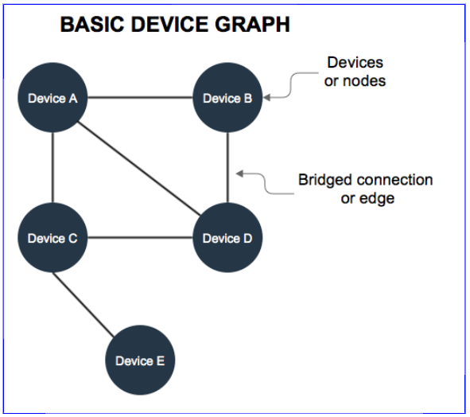

# Device Graph Overview

The _Device Graph_ consists of internet-enabled devices seen on a network and the connections (or edges) shared between each device. In the Device Graph, a "connection" is not a physical link between devices. In this case, the "connection" or "edge" refers to a virtual relationship between devices. This relationship is based on how recently and frequently 2 (or more) devices are seen together on a network.

## Building the Device Graph

We build the device graph with a process known as bridging. Bridging lets our systems identify and make connections between devices on the same network. The result is a map of all the devices on a particular network. In addition to bridging, our systems create and assigns various numeric scores to the connections between each device. These scores are designed to quantify relationship (strong or weak) between devices in the graph.

## Composition

A typical device graph contains:

- Desktop and laptop computers
- Tablets
- Mobile phones
- Game consoles
- Internet-enabled television sets
- Other networked devices

## Data sources

The Device Graph builds device connections from:

- HTTP headers in an ad impression.
- API and SDK calls.
- Information provided by third-party data partners.

See the following table for more information.