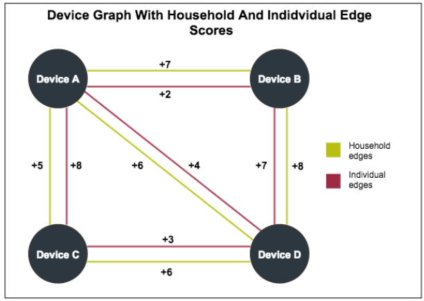
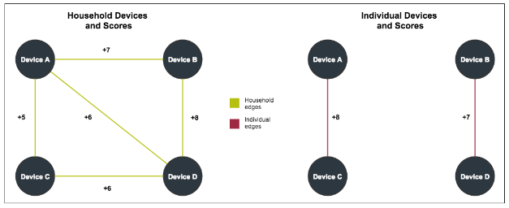

# Individual Scores

Individual scores measure the relationship strength within a household group in the Device Graph. They also help you sync IDs and reach devices at the user level.

- High scores suggest a closer connection between devices in a household than lower scores. High scores improve accuracy, but reduce reach.

- Low scores suggest a looser connection between devices in a household than higher scores. Low scores reduce accuracy, but increase reach.

Keep in mind, however, that these scored connections are abstract representations of different data points. They are not physical links between nodes.

## Purpose of individual scores

As described in the [Device Graph Overview](graph-basics.md), a device graph is a map of connected devices on a network. By itself, a device map is not very useful because the nodes and connections (edges) between them look identical. As a result, we need a way to identify and define the relationships between each device in a household _and_ attempt to differentiate devices by their individual owners.

A metric, known as a [household score](household-scores.md) helps us understand the relationships between and among different devices.

After building a graph with a household score, we can develop and apply an _individual score_ to mapped devices in the household. An individual score ranges from 1 (weakest) to 10 (strongest). Devices with higher scores are more likely to belong to the same user than devices with lower scores. Individual scores quantify the relationship between devices and users in a household and help make accurate, cross-device targeting possible.

## Individual and household scores compared

To help you understand how individual scores work, take a look at the following illustration. It maps household and individual scores in a simple device graph. The graph contains Devices A through D and their corresponding scores.

Let's separate the devices by edge type and drop any connections less than 5. This shows us that:

- High household scores between A, B, C, and D suggest these devices belong to the same household.

- High individual scores between A - C and D - B suggest these devices belong to different users. The other individual edge/score combinations for these devices are too low to make statistically confident assertions about device ownership.

- Comparing individual scores among all the devices suggests there are 2 distinct device users/owners in this household.

## Building individual scores

Individual scores are based on comparing and scoring the browsing behaviors of different devices described below.

### Collect data

The collection process gathers activity data about a device for a given context at a particular time. A context consists of browser or app-based activity such as visiting a website or using an app. The end result is a list of sites or apps visited or used by a device.

### Correlate data

The correlation process builds an activity matrix from collected data. The matrix compares devices to site visits or app usage. For example, visiting a Google fantasy sports site on an iPhone might also show a correlation with visits to sites like ESPN.

### Score edges

Within a household, we score edges between devices that overlap on a similar site or app visits. Based on the results from a [Pearson correlation](https://en.wikipedia.org/wiki/Pearson_correlation_coefficient), these edges get assigned a raw score that ranges between 0 and 1.

### Test edges

Edge testing compares the activity between devices connected by a "real" edge with devices connected by a "false" edge. A "real" edge is an actual connection/relationship between 2 devices. A "false" edge is an artificial connection/relationship between to other separate but identical devices. For example, say iPhone A and iPad A share a real edge in the Device Graph. Testing against a false edge links iPhone A to iPad B and iPad A to iPhone B as shown below.

The false edge gets a score, which is compared to the score for the real edge. If the real edge score is greater than the false edge score, the real edge wins. Repeating this test for 1000s of edges lets us create a win rate for the real edge. After testing, we apply a function to the win rate to generate the individual score for the real edge between 2 connected devices.

### Bin scores

Binning creates the 1 - 10 score range. These scores work like household scores. See:

- [What do these scores really mean?](household-scores.md#what-do-the-scores-really-mean)
- [Reach vs accuracy](household-scores.md#reach-vs-accuracy)
