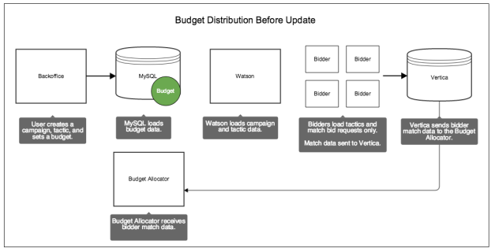
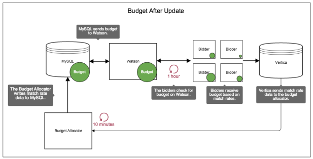

# Understanding Budget Distribution and Update Cycles

The budget allocator, MySQL, Watson, Vertica and the bidders are important components that manage and distribute budgets. Let's look at how their independent operations affect budget data updates and distributions.

## Pre-update budget distribution

In Backoffice, a MySQL database stores budget cap information for ad serving tactics.

However, the budgets aren't immediately available to the bidders.

Another system, the budget allocator, needs to run first and send bidder match rate data to Watson. Match rates let Watson assign budget amounts to each bidder in proportion to how many bids they've matched given the constraints set by a tactic. If the bidders don't have a budget, they'll just sent match rate data to Vertica where it's passed on to the budget allocator.

In the following illustration, the green circle shows you where budget information is distributed before the budget allocator or the bidders update themselves.

## Post-update budget distribution

Let's look at how budget data gets distributed after an update. In the following illustration, the green circle shows you where budget information is distributed after the budget allocator and bidders update themselves.

The table below explains what's happening after a budget distribution cycle.

<html>
<table border="1">
<tr bgcolor=#E5E8E8>
<th>System</th><th>Description</th>
</tr>
<tr>
<td><b>Budget allocator</b></td><td>At 10-minute intervals, the budget allocator checks Vertica for bidder match rate data. It applies a factor to this data, which sets the budget for each bidder, based on their performance. The budget allocator sends this information to MySQL, which passes it on to Watson.</td>
</tr>
<tr>
<td><b>Watson</b></td><td>Watson is the autoritative source of budget information for the bidders. In this system, Watson:
    <ul>
        <li>Allocates budgets to the bidders.</li>
        <li>Tracks bidder spending.</li>
        <li>Stops the bidders when they run out of budget.</li>
    </ul>
    </td>
</tr>
<tr>
    <td><b>Bidders</b></td>
    <td>At 1-hour intervals, the bidders load/reload all the available campaign data from Watson. This ensures they have the latest budget and campaign data.   Also, this update takes bidder performance into account. As a result, the bidders receive budget amounts in proportion to their match rates, i.e., bidders that match a lot of requests receive more budget than those with fewer bid requests. Finally, the bidders continue to send match rate data to Vertical, which passes that information to the budget allocator.</tr>
</table>
</html>
